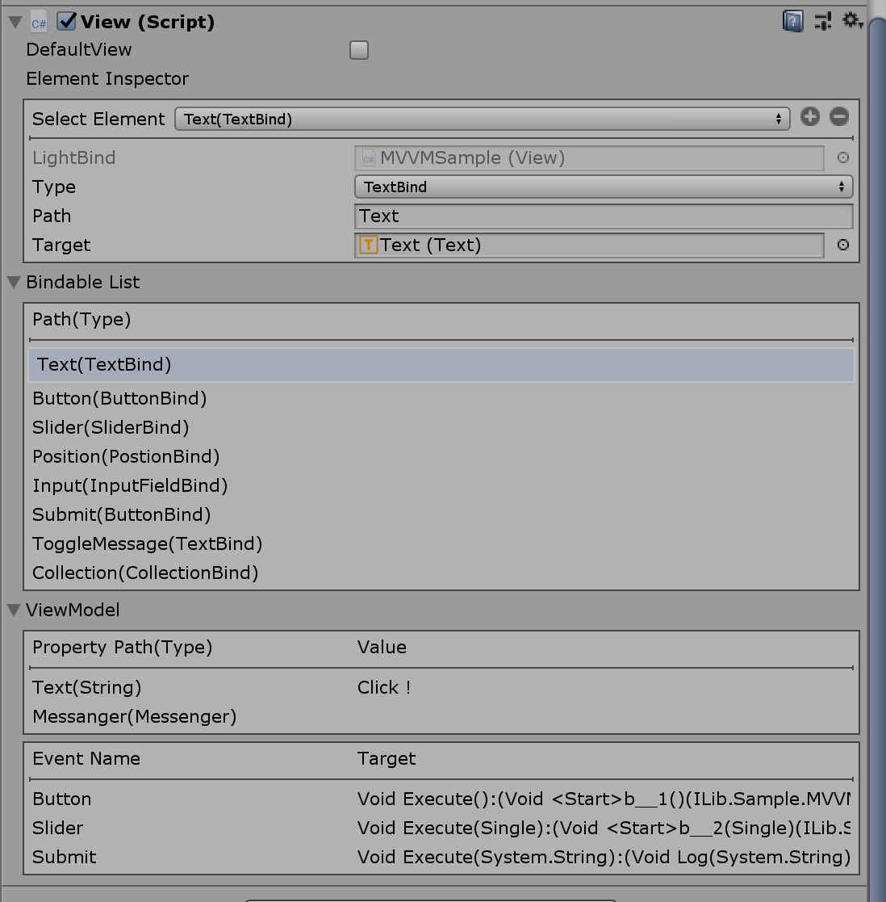
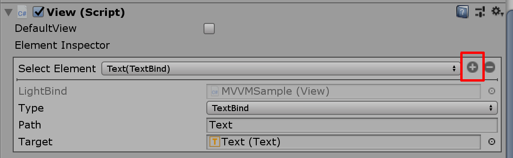
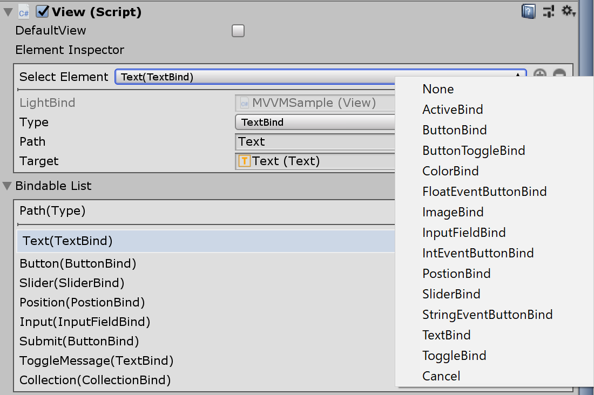
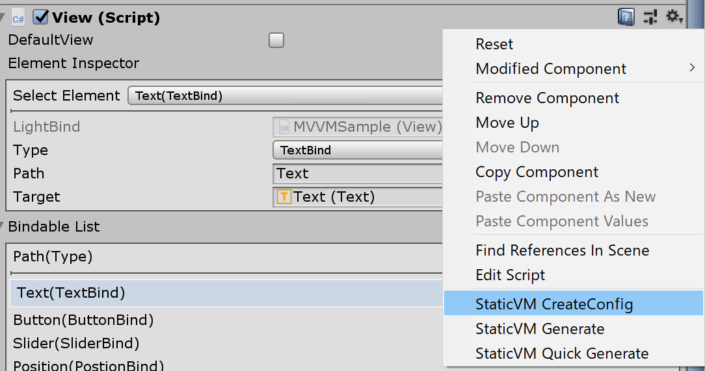
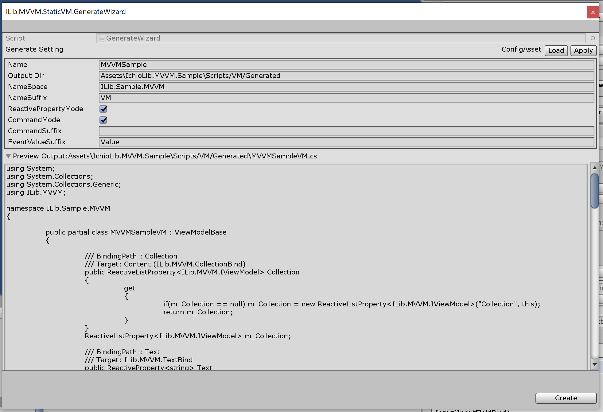
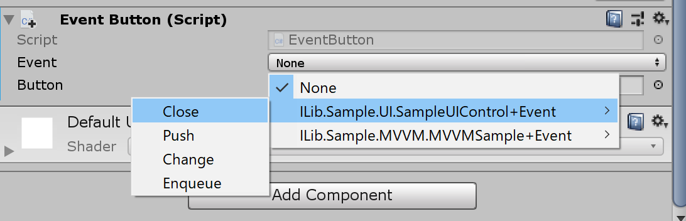

# [ilib-serv-injector](https://github.com/yazawa-ichio/ilib-mvvm)

Unity MVVM DataBinding Package.

リポジトリ https://github.com/yazawa-ichio/ilib-mvvm

## 概要

UnityのUIに対してMVVMでデータバインディングを行うためのパッケージです。  
導入する事でViewModelを通してViewを操作する事で、Model層にUIを操作する実装をなくし疎結合を保つことが可能です。
基本設計は値型を利用する際にボキシングを可能な限り抑える事を目標にしています。  

オプションを持たない指定のコンポートに対しての単一パラメータのバインディングを行う場合、LightBindという軽量のバインダーを利用できます。  
また、プレハブに設定してあるバインダーのパスから自動生成で静的なViewModelを利用するジェネレーターもあります。  

# 使用方法

## Viewの設定

プレハブに対してデータバインディングを行うためにViewを設定します。  
まず、プレハブに対して`View`Componentを`AddComponent`します。  
Viewのバインドの対象は全て`Path`を持ちます。
ViewModelに設定されたデータとBind対象に設定するデータはこの`Path`を通して行われます。

 

### Viewの情報

#### Select Element

ViewがBindする対象のパラメーターを確認出来ます。  
`Component`のBindでは対象のInspectorと同様の物が見れます。  
`LightBind`では`Path`や`Target`を指定や、追加・削除が行えます。

#### Bindable List
Viewにバインドされている対象の一覧が表示されます。
`Select Element`に指定されている対象にはマーカーが付きます。
一覧から`Select Element`の対象を選択する事も出来ます。

#### ViewModel
Viewに紐づけられている、ViewModelの情報が表示されます。
BindにPathが設定されていても、ViewModelに値として設定されていない対象は表示されません。

### LightBindを利用する

LightBindは軽量なバインドです。  
`Component`ではなく型情報、対象、パスの情報だけしか持たないため`View`のみで追加出来ます。  

#### LightBindを追加する

`Select Element`の横の「+」ボタンをクリックすると、新規のメニューを追加出来ます。  
逆に削除する場合は`Select Element`で対象を選択した後「-」のボタンを押すと削除が出来ます。  

 

 

#### LightBindの設定

LightBindで設定できる項目は`Path`と`Target`です。  
追加した後で`Type`を変更する事も可能です。  

### 独自のBindComponentを作成する

`BindBase<T>`もしくは`AssignableBindBase<T>`を継承します。  
`BindBase<T>`は`<T>`で指定した型しか受け取れません。
`AssignableBindBase<T>`は`<T>`にclassしか指定できませんが、代わりに`T`型に代入可能であれば受け取れます。  

例:与えられたstringを指定のFormatで変換して適応するBind
```csharp
using ILib.MVVM;
using UnityEngine.UI;
public class FormatStringTextBind : BindBase<string>
{
	[SerializeField]
	string m_Format = "{0}";
	[SerializeField]
	Text m_Text = null;
	protected abstract void UpdateValue(string val)
	{
		//UpdateはViewModelのパスの更新時のみ反映される
		m_Text.text = string.Format(m_Format, val);
	}
}
```

## ViewModelを設定する

このパッケージのViewModelは`Path`を設定する際に型を明示的に指定します。  
また、ボタンなどのイベントの名前に関してEnumを用いて指定する事が出来ます。  
基本的にUIに応じたViewModelのクラスを作ることを推奨しますが、GeneralViewModelなど汎用的な操作が可能なViewModelも利用できます。  

### 独自のViewModelを作成

ViewModelBaseを継承する事で比較的手軽に実装出来ます。

```csharp
using ILib.MVVM;
public class SampleViewModel : ViewModelBase
{
	//GetImpl/SetImplメソッドを利用すると最も簡単に実装できます。
	public int IntValue
	{
		get => GetImpl<int>("IntValue");
		set => SetImpl<int>("IntValue", value);
	}
	//ReactivePropertyを利用すると値の更新が取得出来ます。
	//StringValue.OnChanged += (x) => { };
	//StringValue.Value = "Update";
	ReactiveProperty<string> m_StringValue;
	public ReactiveProperty<string> StringValue
	{
		get
		{
			if(m_StringValue == null)
			{
				m_StringValue = new ReactiveProperty<string>("StringValue", this);
			}
			return m_StringValue;
		}
	}
	//m_EventのSubscribe/Unsubscribeでイベントを登録できます。
	public event Action<int> OnButton
	{
		add => m_Event.Subscribe<int>("Button", value);
		remove => m_Event.Unsubscribe<int>("Button", value);
	}

}
```

### GeneralViewModel

GeneralViewModelは、汎用的なViewModelの実装です。  
GeneralViewModelに対して、パスやイベントを追加できるため、クラスを定義するまでもない小さなUIなどに利用できます。  
ただし、基本的にパラメーターを固定化する方が安全なので、全てをGeneralViewModelで行うのは非推奨です。  

```csharp
void Prop()
{
	var view = GameObject.FindObjectOfType<View>();
	view.Attach<GeneralViewModel>(vm =>
	{
		//intのデータを設定
		vm.Set<int>("IntValue", 5);
		//ジェネリックで静的に解決出来るので型指定は要らない
		vm.Set("StringValue", "Test");
		//BindBaseの場合は型を厳密に指定する必要があるので
		//明示的に型を指定するケースもある
		vm.Set<IInterface>("ClassValue", new AClass());

		//Commandでイベントを設定できる
		vm.Command("EventName", () => Debug.Log("OnEvent"));
		//ICommandを実装した物でも指定できる
		vm.Command("CommandName", new AppCommand());
	});
}
```

### StaticViewModel

Viewの管理下にあるBindに設定されているPathから、自動でViewModelを出力します。  
同じパスに型の違う物があるケースやPathが変数名に利用できないケースには正常に出力できませんが、基本的に問題になるケースは少ないと思います。
`View`の右上のメニューから実行できます。




#### Configを作成する

`StaticVM CreteConfig`を実行します。
現状Configファイルは、プロジェクトに付き一つです。

#### 作成を行う
`StaticVM Generate`を実行すると作成ウィザードが表示されます。
`GenerateSetting`の大半のパラメーターはConfigの値と連動しています。  
変更した上でApplyを実行すると現在の設定がConfigに反映されます。  
Loadを実行すると現在のConfigの値に戻します。  
`Preview Output`で出力予定のコードが確認できます。



#### 即時作成を行う
`StaticVM CreteConfig`を実行するとコンフィグの設定に合わせて、即時にソースファイルを出力します。  

## Eventを実行する

Viewから発行されたイベントはViewModelの`EventBroker`を通して受け取れます。
イベントの発行は`LightBind`の`ButtonBind`か、`EventButton`を利用します。
イベントには`EventArgument`コンポーネントを用いる事で引数を持たせる事が出来ます。

### EventArgument
ボタンの対象に`EventArgument`コンポーネントを張ることで、イベントの発火時に引数を取得して実行できます。  
例えば`InputFieldArgument`は、指定した`InputField`コンポーネントの`text`プロパティをイベントの引数とするコンポーネントです。  
`EventArgument`は一つしか指定できません。

#### 独自の引数を追加する

`EventArgument<T>`を継承する事で実装できます。  

例:現在時刻を引数に指定するコンポーネント
```csharp
using System;
using ILib.MVVM;
public class DateTimeArgument : EventArgument<DateTime> {

	[SerializeField]
	bool m_Utc = false;
	
	public override DateTime GetValue()
	{
		return m_Utc ? DateTime.UtcNow : DateTime.Now;
	}

}
```


### EventButton
`EventButton`は`Enum`をPathに利用してイベントを発行します。  
受け取り側も`Enum`を利用してイベントを受け取ります。  
指定する`Enum`には`[EventKey]`属性を設定する必要があります。  
**注意点としてEventButtonはStaticViewModelの出力対象にはなりません。**  
UIの共通処理を行うイベント閉じる・進むなどを汎用的な物に利用します。  
EventButtonを利用する事で、共通のイベントを全てのViewModelに実装するようなケースを防げます。

```csharp
//イベントに設定したいenumに[EventKey]属性を追加する
[EventKey]
public enum Event
{
	Close,
	Submit,
}

void Prop()
{
	var view = GameObject.FindObjectOfType<View>();
	view.Attach<GeneralViewModel>(vm =>
	{
		vm.Event.Subscribe(Event.Close, () => {
			//閉じる
			Close(view);
		});
		//型を明示しなくても動作するが、その場合はボックス化が発生する
		vm.Event.Subscribe<Event, string>(Event.Submit, (val) => {
			Submit(val);
		});
	}
}
```
#### EventButton側の設定
対象のボタンに`EventButton`コンポーネントを貼り付けます。  
`Event`のパラメータの候補には`[EventKey]`属性を付けた`Enum`が候補として表示されます。  


## Converterを利用する

コンバーターを利用する事で`BindComponent`の入力に、別の型の入力を変換して更新することが出来ます。  
`Converter`は基本的に対象とするオブジェクトに`AddComponent`する必要があります。  
たとえば、`IntToBoolConverter`はInt値と`Converter`の比較対象のInt値を、設定された比較方法によってbool値として受け取る事が出来ます。
`Converter`は原則一つしか利用できません。

## Messengerを利用する

Messangerはよくあるイベント通知のシステムです。
イベントの送受信側がViewModelへの参照をなくすことが出来ます。  
基本的に飛び道具なので乱用すると危険ですが、適切に利用する分にはViewModelとイベントの受信側の疎結合を実現できます。  

```csharp
public enum Event
{
	Fire
}

void Prop
{
	//イベントを登録
	Messanger.Default.Register(this, "MSG", () => {});
	//引数も指定できる
	Messanger.Default.Register<Event, string>(this, Event.Fire, OnFire);
	//自身に紐づくMessageHandleを登録
	Messanger.Default.RegisterHandle(this);
	//自分に紐づくイベントを解除
	Messanger.Default.Unregister(this);
	//イベントを発火
	Messanger.Default.Send("MSG");
	//引数付きでイベントを発火
	Messanger.Default.Send<Event, string>(Event.Fire, "Fire");

	// handleがGCで回収されるか
	// Disposeが実行されるまで保持される
	// 弱参照でのイベント登録
	var handle = Messanger.Default.WeakRegister(this, "MSG", () => {});

	//イベントの解放
	handle.Dispose();
}

//属性で対象をイベントを登録できる
[MessageHandle("HandleMessage")]
void OnMessage() { }

//Enumも指定できる
[MessageHandle(Event.Fire)]
void OnFire() { }

```

### MesssageButton

基本的に`EventButton`と共通の仕組みで`Messanger`にイベントを発火するボタンです。  
引数は`EventArgument`を利用できます。  

## Behaviorを利用する

BehaviorはMessangerからのイベントやViewModelのデータの更新を検知してアクションを行ったり、Viewで完結するアクションを実行するのに利用します。  
例えば、キャラクターのステータスを表示するUIなどでダメージを受けてViewModelのダメージ時パラメーターが変化した際に、アニメーションを行うなどに利用できます。

## LICENSE

https://github.com/yazawa-ichio/ilib-mvvm/blob/master/LICENSE